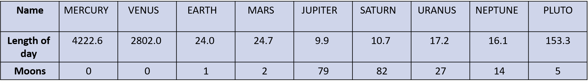

# Nextjs CRUD 

* using next and mongoose create website for planets 
* create schema with the following attribute:
    * PlanetName
    * NumberOfMoon
    * LengthOfDay

* user should be able to:
    * Add new planet
    * Get all planets
    * Get specific planet
    * Delete a planet 

* planet info 

## Bonus:

* Edit planet 